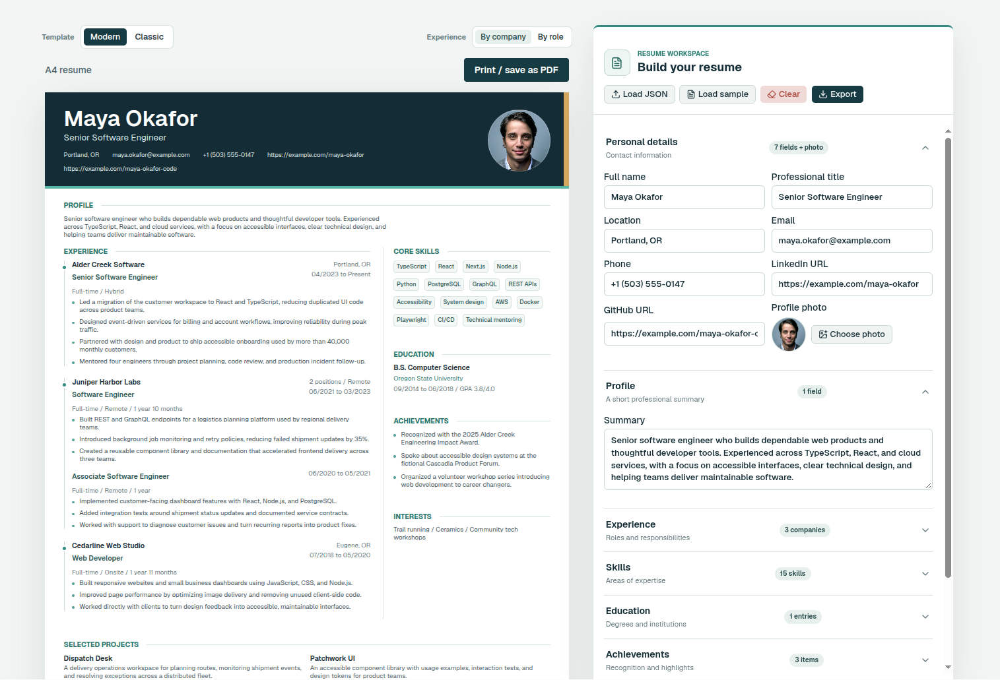

# Resume Builder

A browser-based resume editor with a live A4 preview, two printable designs, and tools to manage your resume data.

[Open the live app](https://resume-builder-orcin-two.vercel.app)



## Features

- **Edit and preview together:** Update personal details, profile, experience, skills, education, achievements, interests, and projects alongside a live A4 preview.
- **Two resume designs:** Switch between Modern and Classic, and group experience by company or by role.
- **Automatic local saving:** Resume changes are saved in this browser and restored on your next visit. Data is not synced between browsers or devices.
- **Profile photo support:** Choose a photo stored separately in browser IndexedDB. Photos are not included in resume JSON files.
- **JSON import and export:** Load an existing resume, restore the sample, or export your current data.
- **Print-ready output:** Print the resume or save it as a PDF.

## Getting Started

Requires Node.js and npm.

```bash
npm install
npm run dev
```

Open [http://localhost:3000](http://localhost:3000).

The first visit loads the fictional example resume in `app/sampleData.json`. Use **Load JSON** to import a resume, **Export** to download the current data, **Load sample** to restore the example, or **Clear** to empty the editor. If no custom photo is selected, the preview uses `public/sample-profile.jpg`.

Imported files must use the resume data structure below. The field names match the example in `app/sampleData.json`.

| Field | Shape |
| --- | --- |
| `personal` | Object with `name`, `title`, `location`, `email`, `phone`, `linkedin`, and `github` strings |
| `summary` | String |
| `experience` | Array of `{ company, location, positions }`; each position has `job_title`, `start_date`, `end_date`, `duration`, `work_type`, `employment_type`, and a `responsibilities` string array. `duration` may be a string or `null`. |
| `skills` | String array |
| `education` | Array of objects with `degree`, `institution`, `start_date`, `end_date`, and `gpa` strings |
| `hobbies` | String array |
| `achievements` | String array |
| `projects` | Array of objects with `name` and `description` strings |

## Commands

```bash
npm run dev      # Start the development server
npm run lint     # Run ESLint
npm run build    # Create a production build
npm start        # Serve the production build (run build first)
```

## Project Structure

- `app/templates/resume-form.tsx` — resume editor and JSON import/export
- `app/templates/template-picker.tsx` — editor state, local persistence, and preview controls
- `app/templates/resume-document.tsx` — shared resume data model and document layout
- `app/templates/modern-resume.tsx` and `app/templates/classic-resume.tsx` — printable designs
- `components/ui/` — shadcn UI components
- `app/sampleData.json` — fictional example resume data used for the first visit and available for import
- `public/sample-profile.jpg` — static profile photo shown when IndexedDB has no selected photo